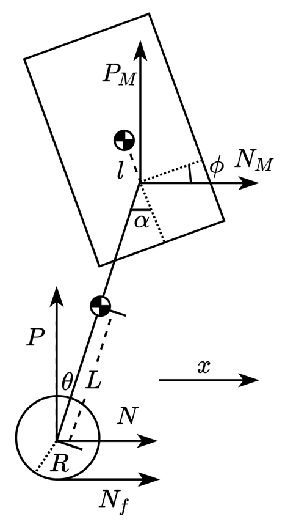
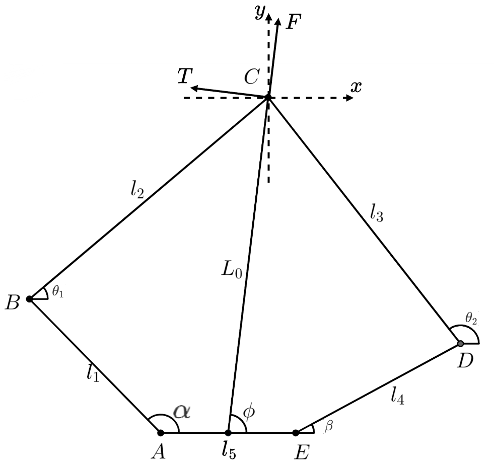
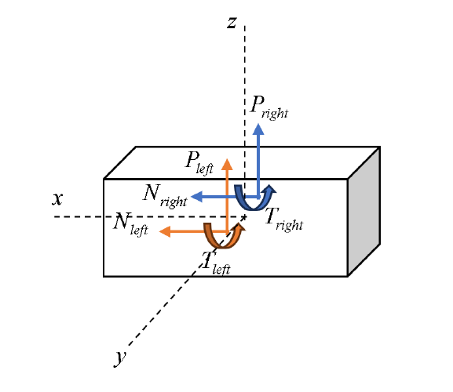

轮腿机器人
---
每条腿三个电机，轮子电机：大扭矩快响应  
            髋关节两电机，作用类似舵机，调整腿的高度、角度
            连接腿的两条连杆将髋关节电机旋转转化为x，y轴运动
闭链五连杆结构、并联腿结构

## 一、pitch角自稳
有公式:
$$
torque = k_p\times pitch\\
\begin{array}{ll}
    其中：&pitch：俯仰倾斜角\\
    &Kp：比例转换系数（随高度改变）\\
    &torque：恢复力矩\\
    &Kp的随高度改变近似于线性\\
    &被称为变PID控制器
\end{array}
$$

### 调试步骤：
- 1. 获取机器人俯仰角度
  - 读取IMU获取pitch
- 2. 控制机器人高度，获取不同的Kp
- 3. 计算出恢复力矩，控制轮子做出反应
```C
  //双环PID,速度环和角度环
  targetPitch = Kp * (targetSpeed - speedAvg)
  Torque = Kp * (targetAngle - Angle)
```
## 二、前进转向
转向：差速法
```C
  //将一种双环pid增加转向力矩项
  Torque1 = Kp * (targetAngle - Angle) + turnTorque
  Torque2 = Kp * (targetAngle - Angle) - turnTorque
  turnTorque = Kp * (targetGyro - GyroZ)
  //前进偏转角度即机体滚转角加速度roll的导数
```

## 运动学逆解  
### 构建模型：
  
- 可得出:
$$
\alpha=2\arctan(\frac{b\pm\sqrt{a^2+b^2-c^2}}{a+c})\qquad(\alpha\in[\frac{\pi}{2},\pi])\\
\begin{array}{ll}
  其中:&a=2xL_1\\
  &b=2yL_1\\
  &c=x^2+y^2+L_1^2-L_2^2
\end{array}\\[20pt]
\beta=2arctan(\frac{e\pm\sqrt{d^2+e^2-f^2}}{d+f})\qquad(\beta\in[0,\frac{\pi}{2}])\\
\begin{array}{ll}
  其中:&d=2(x-L_5)L_4\\
  &e=2yL_4\\
  &f=(x-L_5)^2+L_4^2+y^2-L_3^2
\end{array}
$$

## 运动学正解  
- 可得出:
$$
\begin{cases}
  x=L_1\cos\alpha+L_2\cos\theta_1\\
  y=L_1\sin\alpha+L_2\sin\theta_1
\end{cases}\\
  其中:\theta_1=2\arctan\displaystyle\frac{b\pm\sqrt{a^2+b^2-c^2}}{a+c}\qquad(\theta_1\in[0,\frac{\pi}{2}])\\
  其中：\begin{cases}
    a=2(x_a-x_c)L_2\\
    b=2(y_a-y_c)L_2\\
    c=L_3^2-L_2^2-L_{AC}^2\\
    L_{AC}=\sqrt{(x_a-x_c)^2+(y_a-y_c)^2}
  \end{cases}\\
  其中：\begin{cases}
    x_a=L_1\cos\alpha\\
    y_a=L_1\sin\alpha\\
    x_c=L_5+L_4\cos\beta\\
    y_c=L_4\sin\beta
  \end{cases}
$$

---
# 单腿建模
## 1. 平衡与纵向运动控制
### 1.1 系统建模
关注**上层姿态**和**腿部姿态**和**驱动轮运动**，先忽略腿长变化，仅考虑腿的姿态，即驱动轮轴与腿部关节电机连线相对惯性系的**角度**  
据此可得到模型：



| 符号     | 含义                     | 正方向     | 单位                         |
| -------- | ------------------------ | ---------- | ---------------------------- |
| $\theta$ | 摆杆与竖直方向夹角       | 图示为正   | $\mathrm{rad}$               |
| $x$      | 驱动轮位移               | 箭头所示   | $\mathrm{m}$                 |
| $\phi$   | 机体与水平夹角           | 图示为正   | $\mathrm{rad}$               |
| $T$      | 驱动轮输出力矩           | $同\theta$ | $\mathrm{N}\cdot \mathrm{m}$ |
| $T_p$    | 髋关节输出力矩           | $同\alpha$ | $\mathrm{N}\cdot \mathrm{m}$ |
| $N$      | 驱动轮对摆杆力的水平分量 | 箭头所示   | $\mathrm{N}$                 |
| $P$      | 驱动轮对摆杆力的竖直分量 | 箭头所示   | $\mathrm{N}$                 |
| $N_M$    | 摆杆对机体力的水平分量   | 箭头所示   | $\mathrm{N}$                 |
| $P_M$    | 摆杆对机体力的竖直分量   | 箭头所示   | $\mathrm{N}$                 |
| $N_f$    | 地面对驱动轮的摩擦力     | 箭头所示   | $\mathrm{N}$                 |

| 符号  | 含义                   | 单位                            |
| ----- | ---------------------- | ------------------------------- |
| $R$   | 驱动轮半径             | $\mathrm{m}$                    |
| $L$   | 摆杆重心到驱动轮距离   | $\mathrm{m}$                    |
| $L_M$ | 摆杆重心到机体转轴距离 | $\mathrm{m}$                    |
| $l$   | 机体重心到其转轴的距离 | $\mathrm{m}$                    |
| $m_w$ | 驱动轮转子质量         | $\mathrm{kg}$                   |
| $m_p$ | 摆杆质量               | $\mathrm{kg}$                   |
| $M$   | 机体质量               | $\mathrm{kg}$                   |
| $I_w$ | 驱动轮转子转动惯量     | $\mathrm{kg}\cdot \mathrm{m^2}$ |
| $I_p$ | 摆杆绕质心转动惯量     | $\mathrm{kg}\cdot \mathrm{m^2}$ |
| $I_M$ | 机体绕质心转动惯量     | $\mathrm{kg}\cdot \mathrm{m^2}$ |
### 1.2 力学分析
对驱动轮，有：
$$
\begin{align}
  m_wx''=N_f-N\tag{1.1}\\
  I_w\frac{x''}{R}=T-N_fR\tag{1.2}
\end{align}
$$
合并式子(1.1)、(1.2)消去$N_f$得到$x''$的表达式：
$$
\begin{align}
  x''=\displaystyle\frac{T-NR}{\frac{I_w}{R}+m_wR}\tag{1.3}
\end{align}
$$
对摆杆，有：
$$
\begin{align}
  N-N_M=m_p\frac{\partial^2}{\partial t^2}(x+L\sin\theta)\tag{1.4}\\
  P-P_M-m_pg=m_p\frac{\partial^2}{\partial t^2}(L\cos\theta)\tag{1.5}\\
  I_p\theta''=(PL+P_M L_M)\sin\theta-(NL+N_ML_M)\cos\theta-T+T_p\tag{1.6}\\
\end{align}
$$
对机体，有：
$$
\begin{align}
  N_M=M\frac{\partial^2}{\partial t^2}(x+(L+L_M)\sin\theta-l\sin\phi)\tag{1.7}\\
  P_M-Mg=M\frac{\partial^2}{\partial t^2}((L+L_M)\cos\theta+l\cos\phi)\tag{1.8}\\
  I_M\phi''=T_p+N_Ml\cos\phi+P_Ml\sin\phi\tag{1.9}\\
\end{align}
$$

### 1.3 状态空间模型
定义状态向量$x$和控制向量$u$分别为：
$$
\vec{x}=\begin{bmatrix}
  \theta\\\theta'\\x\\x'\\\phi\\\phi'
\end{bmatrix}\qquad
\vec{u}=\begin{bmatrix}T\\T_p\end{bmatrix}
$$
定义系统非线性模型:
$$
\vec{x'}=f(\vec{x},\vec{u})
$$


##

## 2.VMC控制


  VMC()是一种不以直接控制关节角度，而是以一种柔性，类似虚拟弹簧、阻尼器构建的足端虚拟力
  
$$
\dot{\theta_1}=-\displaystyle\frac{L_4\dot{\beta} \sin(\beta - \theta_2)+L_1\dot{\alpha}\sin(\alpha - \theta_2)}{L_2\sin(\theta_1-\theta_2)}\\[10pt]
\text{将}\begin{cases}
  \sin{\theta_1}=\displaystyle\frac{x_\alpha}{L_1}\\[5pt]
  \cos{\theta_1}=\displaystyle\frac{y_\alpha}{L_1}\\[5pt]
  \cos\theta_2=\displaystyle\frac{x_c-x}{L_3}\\[5pt]
  \sin\theta_2 = \displaystyle\frac{y_c-y}{L_3}
\end{cases}\text{代入式中}\\[10pt]
使用matlab可以求解出\\[8pt]
J=\begin{bmatrix}
   \displaystyle\frac{L1\sin\theta_2\sin(\alpha- \theta_1)}{\sin(\theta_1- \theta_2)}&
  -\displaystyle\frac{L4\sin\theta_1\sin(\beta - \theta_2)}{\sin(\theta_1- \theta_2)}\\
  -\displaystyle\frac{L1\cos\theta_2\sin(\alpha - \theta_1)}{sin(\theta_1 - \theta_2)}&
  \displaystyle\frac{L4\cos\theta_1\sin(\beta - \theta_2)}{sin(\theta_1- \theta_2)}
\end{bmatrix}\\[10pt]
\because 足端力矩F_{end}=\begin{bmatrix}
  F_x\\F_y
\end{bmatrix}\qquad 关节力矩\tau=\begin{bmatrix}
  \tau_1 \\ \tau_2
\end{bmatrix}\\[10pt]
每个关节所需力矩,有：
\tau=J^TF_{end}\\[8pt]
利用旋转矩阵\mathbf{R}将\begin{bmatrix}
  F_x&F_y
\end{bmatrix}^T旋转至极坐标方向：\\[8pt]
\begin{bmatrix}
  F_x\\F_y
\end{bmatrix}=\begin{bmatrix}
  \cos(\phi-\pi/2)&-\sin(\phi-\pi/2)\\
  \sin(\phi-\pi/2)&\cos(\phi-\pi/2)
\end{bmatrix}\begin{bmatrix}
F_c\\F_t
\end{bmatrix}\\[8pt]
其中F_c,F_t分别为末端沿L_0和垂直于L_0的虚拟力，再利用变换矩阵\mathbf{M}\\可映射至最终的虚拟力F=\begin{bmatrix}
  F&T_p
\end{bmatrix}^T;\\[8pt]
\begin{bmatrix}
  T_1\\T_2
\end{bmatrix}=\begin{bmatrix}
  0&-\frac{1}{L_0}\\
  1&0
\end{bmatrix}\begin{bmatrix}
  F\\T_p
\end{bmatrix}\\[8pt]
即\begin{bmatrix}
  T_1\\T_2
\end{bmatrix}=J^TRM\begin{bmatrix}
  F\\T_p
\end{bmatrix}
通过\text{MATLAB}进行计算，可得到最终结果:\\[8pt]
\begin{bmatrix}
  T_1\\T_2
\end{bmatrix}=\begin{bmatrix}
  \displaystyle\frac{l_1\sin(\phi-\theta_2)\sin(\alpha-\theta_1)}{\sin(\theta_2-\theta_1)}&
  \displaystyle\frac{l_1\cos(\phi-\theta_1)\sin(\alpha-\theta_1)}{l_0\sin(\theta_2-\theta_1)}\\[8pt]
  \displaystyle\frac{l_4\sin(\phi-\theta_1)\sin(\theta_2-\beta)}{\sin(\theta_2-\theta_1)}&
  \displaystyle\frac{l_4\cos(\phi-\theta_2)\sin(\theta_2-\beta)}{l_0\sin(\theta_2-\theta_1)}
\end{bmatrix}\begin{bmatrix}
  F\\T_p
\end{bmatrix}
$$

# 双腿建模
## 1.意义
- 双腿建模的目的是消解LQR的自稳与pid转向之间的矛盾，在转向力矩过大时会与LQR的自稳倾向发生干涉以至于无法稳定，而双腿建模将两条腿都纳入空间状态方程后，可以将yaw作为状态同时加入LQR控制。
## 2.建模公式
- #### 轮与腿的共同建模部分与单腿模型相同，为方便计算，两腿坐标系关于中间平面对称，

- #### 忽略两虚拟力作用点对质心在x，z轴上的偏移，仅考虑y轴偏移对yaw的影响，有如下方程：
  $$
  \begin{cases}
    I_x\displaystyle\frac{\partial^2}{\partial t^2}roll=(P_{left}-P_{right})y_{bias}\\[8pt]
    I_y\displaystyle\frac{\partial^2}{\partial t^2}pitch=T_{left}+T_{right}\\[8pt]
    I_z\displaystyle\frac{\partial^2}{\partial t^2}yaw=(N_{right}-N_{left})y_{bias}\\[8pt]
    m\displaystyle\frac{\partial^2x}{\partial t^2}=N_{left}-N_{right}\\[8pt]
    m\displaystyle\frac{\partial^2z}{\partial t^2}=P_{left}+P_{right}-mg\\[8pt]
    roll=\arctan\displaystyle\frac{(L_l\theta_l-L_r\theta_r)}{L_{width}}
  \end{cases}\\[10pt]
  \begin{array}{l}
    其中pitch=-\phi\\[8pt]
    设：状态\dot{x}=\begin{bmatrix}
    x,\dot{x},yaw,\dot{yaw},roll,\dot{roll},\theta_{l},\dot{\theta}_{l},\theta_{r},\dot{\theta}_{r},\phi,\dot{\phi}
  \end{bmatrix}^T\\[8pt]
  输入u=\begin{bmatrix}
    T_{wl},T_{ll},T_{wr},T_{lr}
  \end{bmatrix}^T
  \end{array}
  $$